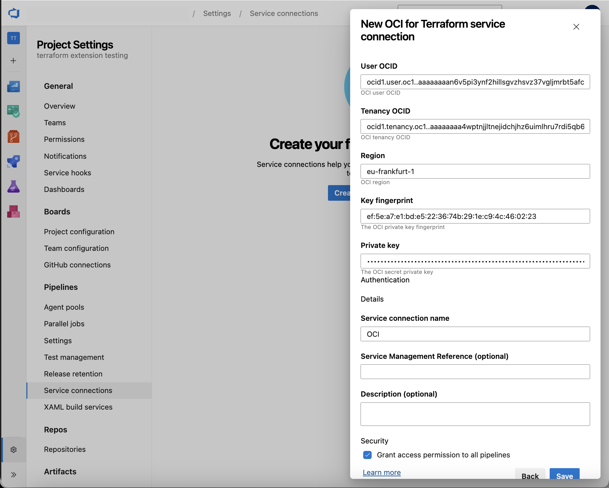

## About Terraform

Terraform is an open-source tool created by HashiCorp (an IBM Company) for developing, changing and versioning infrastructure safely and efficiently. It provides a service known as "Infrastructure as Code" which enables users to define and provision infrastructure using a high-level configuration language.

## About the Terraform extension

This extension provides the following components:

- A task for installing a specific version of Terraform, if not already installed, on the agent
- A task for executing the core Terraform commands
- A service connection for connecting to an Amazon Web Services(AWS) account
- A service connection for connecting to a Google Cloud Platform(GCP) account
- A service connection for connecting to a Oracle Cloud Infrastructure(OCI) account

The Terraform tool installer task acquires a specified version of [Terraform](https://www.terraform.io/) from the Internet or the tools cache and prepends it to the PATH of the Azure Pipelines Agent (hosted or private). This task can be used to change the version of Terraform used in subsequent tasks. Adding this task before the Terraform task in a build definition ensures you are using that task with the right Terraform version.

The Terraform task enables running Terraform commands as part of Azure Build and Release Pipelines providing support for the following Terraform commands

- init
- validate
- show
- plan
- apply
- output
- custom (any command terraform CLI supports natively)
- destroy

This extension is intended to run on **Windows**, **Linux** and **MacOS** agents.

## Terraform tool installer task

The TerraformInstaller task installs a specific version of Terraform on the agent. The task can be used to install a specific version of Terraform or the latest version.

### Example: Install the latest version of Terraform

```yaml
- task: TerraformInstaller@1
  displayName: 'Install Terraform'
  inputs:
    terraformVersion: 'latest'
```

### Example: Install a specific version of Terraform

```yaml
- task: TerraformInstaller@1
  displayName: 'Install Terraform'
  inputs:
    terraformVersion: '1.11.3'
```

## Terraform task

The Terraform task abstracts running Terraform commands as part of an Azure DevOps Pipeline.

### Steps to use the Terraform task

- Install this task from the [Marketplace](https://aka.ms/devlabs/tf/task).
- Create a service connetion if you don't already have one. See the [Creating a new service connection](#creating-a-new-service-connection) section below for more details.
- Create or open a YAML pipeline.
- Add the Terraform task to your pipeline YAML file.

### Example: Run Terraform init, plan and apply for Microsoft Azure

>NOTE: Terraform on Azure currently only supports support the use of separate credentials / service connections for backend storage account and the Azure providers when using Workload identity federation with ID Token Refresh. If you are not using Workload identity federation with ID Token Refresh, you must use the same service connection for both the backend and the providers.

```yaml
- task: TerraformTask@5
  displayName: Run Terraform Init
  inputs:
    provider: 'azurerm'
    command: 'init'
    backendServiceArm: 'your-service-connection'
    backendAzureRmStorageAccountName: 'your-stg-name'
    backendAzureRmContainerName: 'your-container-name'
    backendAzureRmKey: 'state.tfstate'

- task: TerraformTask@5
  name: terraformPlan
  displayName: Run Terraform Plan
  inputs:
    provider: 'azurerm'
    command: 'plan'
    commandOptions: '-out tfplan'
    environmentServiceNameAzureRM: 'your-service-connection'

# Only runs if the 'terraformPlan' task has detected changes the in state.
- task: TerraformTask@5
  displayName: Run Terraform Apply
  condition: and(succeeded(), eq(variables['terraformPlan.changesPresent'], 'true'))
  inputs:
    provider: 'azurerm'
    command: 'apply'
    commandOptions: 'tfplan'
    environmentServiceNameAzureRM: 'your-service-connection'
```

### Example: Run Terraform init, plan and apply for AWS

```yaml
- task: TerraformTask@5
  displayName: Run Terraform Init
  inputs:
    provider: 'aws'
    command: 'init'
    backendServiceAWS: 'your-service-connection'
    backendAWSBucketName: 'your-bucket-name'
    backendAWSKey: 'state.tfstate'

- task: TerraformTask@5
  name: terraformPlan
  displayName: Run Terraform Plan
  inputs:
    provider: 'aws'
    command: 'plan'
    commandOptions: '-out tfplan'
    environmentServiceNameAWS: 'your-service-connection'

# Only runs if the 'terraformPlan' task has detected changes the in state.
- task: TerraformTask@5
  displayName: Run Terraform Apply
  condition: and(succeeded(), eq(variables['terraformPlan.changesPresent'], 'true'))
  inputs:
    provider: 'aws'
    command: 'apply'
    commandOptions: 'tfplan'
    environmentServiceNameAWS: 'your-service-connection'
```

### Example: Run Terraform init, plan and apply for GCP

```yaml
- task: TerraformTask@5
  displayName: Run Terraform Init
  inputs:
    provider: 'gcp'
    command: 'init'
    backendServiceGCP: 'your-service-connection'
    backendGCPBucketName: 'your-bucket-name'
    backendGCPPrefix: 'state.tfstate'

- task: TerraformTask@5
  name: terraformPlan
  displayName: Run Terraform Plan
  inputs:
    provider: 'gcp'
    command: 'plan'
    commandOptions: '-out tfplan'
    environmentServiceNameGCP: 'your-service-connection'

# Only runs if the 'terraformPlan' task has detected changes the in state.
- task: TerraformTask@5
  displayName: Run Terraform Apply
  condition: and(succeeded(), eq(variables['terraformPlan.changesPresent'], 'true'))
  inputs:
    provider: 'gcp'
    command: 'apply'
    commandOptions: 'tfplan'
    environmentServiceNameGCP: 'your-service-connection'
```

### Example: Run Terraform init, plan and apply for OCI

```yaml
- task: TerraformTask@5
  displayName: Run Terraform Init
  inputs:
    provider: 'oci'
    command: 'init'
    backendServiceOCI: 'your-service-connection'
    backendOCIPar: 'state.tfstate'

- task: TerraformTask@5
  name: terraformPlan
  displayName: Run Terraform Plan
  inputs:
    provider: 'oci'
    command: 'plan'
    commandOptions: '-out tfplan'
    environmentServiceNameOCI: 'your-service-connection'

# Only runs if the 'terraformPlan' task has detected changes the in state.
- task: TerraformTask@5
  displayName: Run Terraform Apply
  condition: and(succeeded(), eq(variables['terraformPlan.changesPresent'], 'true'))
  inputs:
    provider: 'oci'
    command: 'apply'
    commandOptions: 'tfplan'
    environmentServiceNameOCI: 'your-service-connection'
```

### Input parameters

The Terraform task has the following input parameters:

#### Shared Inputs

- `provider`: The cloud provider to use. The options are `azurerm`, `aws`, `gcp`, and `oci`. The default value is `azurerm`.
- `command`: The Terraform command to run. The options are `init`, `validate`, `show`, `plan`, `apply`, `output`, `destroy`, and `custom`. The default value is `init`.
- `workingDirectory`: The working directory to run the command in. The default value is `$(System.DefaultWorkingDirectory)`.

#### Backend Specific Inputs for the `init` command

##### Azure Specific Inputs for `init`

- `backendServiceArm`: The name of the Azure service connection to use for the `azurerm` backend. The default value is `''`.
- `backendAzureRmUseEntraIdForAuthentication`: Use Azure Entra ID for authentication for the storage account. The default value is `true`.
- `backendAzureRmStorageAccountName`: The name of the Azure storage account to use for the `azurerm` backend. The default value is `''`.
- `backendAzureRmContainerName`: The name of the Azure storage container to use for the `azurerm` backend. The default value is `''`.
- `backendAzureRmKey`: The name of the Azure storage blob to use for the `azurerm` backend. The default value is `''`.
- `backendAzureRmOverrideSubscriptionID`: The override subscription ID to use for the `azurerm` backend. This is only required if using URI lookup and if you don't want to use the service connection subscription ID. The default value is `''`.
- `backendAzureRmResourceGroupName`: The name of the Azure resource group the Storage Account sits in to use for the `azurerm` backend. This is only required if using URI lookup. The default value is `''`.
- `backendAzureRmUseIdTokenGeneration`: Whether to use ID token generation for the `azurerm` backend Workload identity federation. This is a fallback setting for older backend versions and can result in unexpected timeout issues. The default value is `false`.

##### AWS Specific Inputs for `init`

- `backendServiceAWS`: The name of the AWS service connection to use for the `aws` backend. The default value is `''`.
- `backendAWSBucketName`: The name of the AWS S3 bucket to use for the `aws` backend. The default value is `''`.
- `backendAWSBucketKey`: The name of the AWS S3 object to use for the `aws` backend. The default value is `''`.

##### GCP Specific Inputs for `init`

- `backendServiceGCP`: The name of the GCP service connection to use for the `gcp` backend. The default value is `''`.
- `backendGCPBucketName`: The name of the GCP bucket to use for the `gcp` backend. The default value is `''`.
- `backendGCPPrefix`: The name of the GCP object to use for the `gcp` backend. The default value is `''`.

##### OCI Specific Inputs for `init`

- `backendServiceOCI`: The name of the OCI service connection to use for the `oci` backend. The default value is `''`.
- `backendOCIPar`: The OCI object storage PAR configuration for the Terraform remote state file to use for the `oci` backend. The default value is `''`.
- `backendOCIConfigGenerate`: Whether to generate the Terraform remote state file config (Use Yes when not included in TF files) for the `oci` backend. The default value is `yes`.

#### Command and Cloud Specific Inputs for the `plan`, `apply`, and `destroy` commands

- `commandOptions`: The addtiional command arguments to pass to the command. The default value is `''`.
- `customCommand`: The custom command to run if `command` is set to `custom`. The default value is `''`.
- `outputTo`: Choose whether to output to the console or a file for the `show` and `output` Terraform commands. The options are `console`, and `file`. The default value is `console`.
- `fileName`: The name of the file to output to for the `show` and `output` commands if `outputTo` is set to `file`. The default value is `''`.
- `outputFormat`: The output format to use for the `show` command. The options are `json`, and `default`. The default value is `default`.

##### Azure Specific Inputs for `plan`, `apply`, and `destroy`

- `environmentServiceNameAzureRM`: The name of the Azure service connection to use for the Azure providers. The default value is `''`.
- `environmentAzureRmOverrideSubscriptionID`: The override subscription ID to use for the Azure providers. This is only required if you don't want to use the service connection subscription ID. The default value is `''`.
- `environmentAzureRmUseIdTokenGeneration`: Whether to use ID token generation for the Azure providers with Workload identity federation. This is a fallback setting for older provider versions and can result in unexpected timeout issues. The default value is `false`.

##### AWS Specific Inputs for `plan`, `apply`, and `destroy`

- `environmentServiceNameAWS`: The name of the AWS service connection to use for the `aws` provider. The default value is `''`.

##### GCP Specific Inputs for `plan`, `apply`, and `destroy`

- `environmentServiceNameGCP`: The name of the GCP service connection to use for the `gcp` provider. The default value is `''`.

##### OCI Specific Inputs for `plan`, `apply`, and `destroy`

- `environmentServiceNameOCI`: The name of the OCI service connection to use for the `oci` provider. The default value is `''`.

### Creating a new service connection

The Terraform task requires a service connection for setting up the credentials to connect to the provider account. For setting up a new service connection:

#### Create a new service connection for connecting to an Azure account

Follow the instructions in the [Azure DevOps documentation](https://learn.microsoft.com/en-us/azure/devops/pipelines/library/connect-to-azure?view=azure-devops) to create a new service connection for connecting to an Azure account using Workload identity federation.

#### Create a new service connection for connecting to an AWS account

The Terraform task requires a AWS service connection for setting up the credentials to connect to an AWS account. For setting up a new AWS service connection:

- On the project page, go to **Project settings** and choose **Service connections**.
- In the **New service connection** list, choose **AWS for Terraform**.
- Enter the following details to set up the service connection:
  - **Connection name\*:** Enter a unique name of the service connection to identify it within the project
  - **Access key id\*:** Enter the access key id for your AWS account
  - **Secret access key\*:** Enter the secret access key associated with the access key id
  - **Region\*:** Enter the region of the Amazon Simple Storage Service(S3) bucket in which you want to store the Terraform remote state file e.g. 'us-east-1'


#### Create a new service connection for connecting to a GCP account

The Terraform task requires a GCP service connection for setting up the credentials to connect to a GCP service account. For setting up a new GCP service connection:

- Download the JSON key file containing the required credentials
  - In the GCP Console, go to the **[Create service account key](https://console.cloud.google.com/apis/credentials/serviceaccountkey?_ga=2.139902131.-101031797.1559296298)** page.
  - From the **Service account** list, select the existing service account or **New service account** to create a new one.
  - If **New service account** was selected in the previous step, in the **Service account name** field, enter a name.
  - From the **Role** list, select **Project** > **Owner**.
  - Click **Create**. A JSON file that contains your key downloads to your computer.
- On the project page, go to **Project settings** and choose **Service connections**.
- In the **New service connection** list, choose **GCP for Terraform**.
- Enter the following details to set up the service connection:
  - **Connection name\*:** Enter a unique name of the service connection to identify it within the project
  - **Project id\*:** Enter the project id of the GCP project in which the resources will be managed
  - **Client email\*:** Enter the value of the **client_email** field in the JSON key file
  - **Token uri\*:** Enter the value of the **token_uri** field in the JSON key file
  - **Scope\*:** Enter the scope of access to GCP resources e.g. https://www.googleapis.com/auth/cloud-platform. For more information, see [granting roles to service accounts](https://cloud.google.com/iam/docs/granting-roles-to-service-accounts)
  - **Private key\*:** Enter the value of the **private_key** field in the JSON key file


#### Create a new service connection for connecting to a OCI account

The Terraform task requires a OCI service connection for setting up the credentials to connect to an OCI account. For setting up a new OCI service connection:

- Using OCI Console add an API Key by generating it (https://docs.oracle.com/en-us/iaas/Content/API/Concepts/apisigningkey.htm#two) and download it
- On the project page, go to **Project settings** and choose **Service connections**.
- In the **New service connection** list, choose **OCI for Terraform**.
- Enter the following details to set up the service connection:
  - **Connection name\*:** Enter a unique name of the service connection to identify it within the project
  - **User OCID\*:** Enter the OCI account **user OCID** copying it from your OCI Console User Profile information
  - **Tenancy OCID\*:** Enter the OCI **tenancy OCID** copying it from your OCI Console Tenancy information
  - **Region\*:** Enter the value of the **region** you want to manage with Terraform e.g. eu-frankfurt-1
  - **Key fingerprint\*:** Enter the value of the API Key **fingerprint** copying it from OCI Console generated in the first step
  - **Private key\*:** Enter the value of the contents of the **private_key** file generated and downloaded in the first step



## Troubleshooting

### How to resolve an error about AzureCLI Authorizer

In you are using older Azure provider or backend versions, you may encounter the following or similar error when running the Terraform task:

`Error: unable to build authorizer for Resource Manager API: could not configure AzureCli Authorizer: obtaining subscription ID: obtaining account details: running Azure CLI: exit status 1: ERROR: Please run 'az login' to setup account.`

If you see an error like this, then it means you are using a provider or backend version that does not support Workload identity federation ID Token Refresh. To resolve this, you can either:

1. Update your Terraform CLI and / or Azure proividers to the latest version (recommended)
2. Fallback to ID token generation by setting the `backendAzureRmUseIdTokenGeneration` and / or `environmentAzureRmUseIdTokenGeneration` inputs to `true` in the Terraform task. This is a fallback setting for older provider versions and can result in unexpected timeout issues, so please consider using current versions of the Terraform CLI and Azure providers before resorting to this option.

Support for ID Token Refresh was introduced in:

- Terraform CLI 1.11.1
- AzureRM Provider 4.18.0
- AzureAD Provider 3.2.0
- AzAPI Provider 2.0.1
