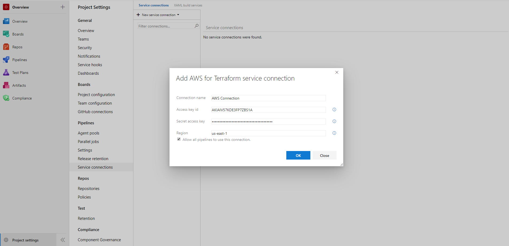
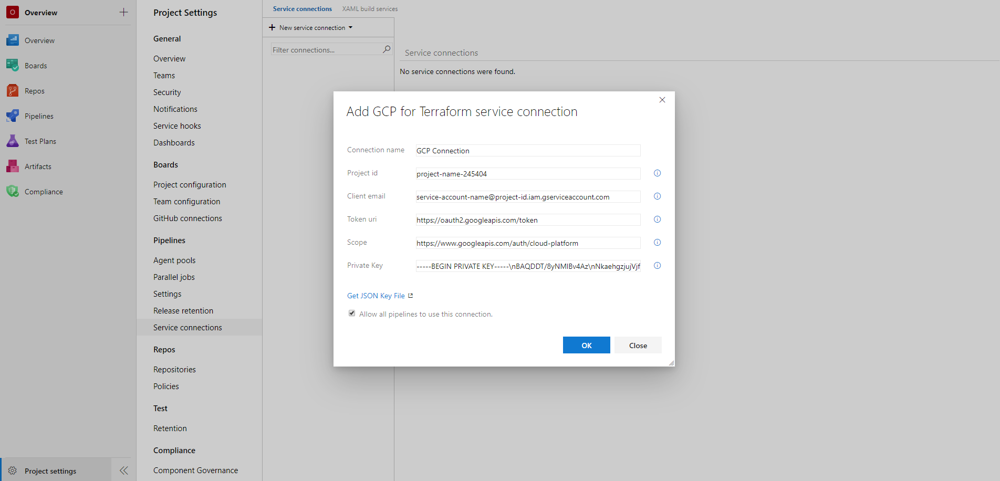
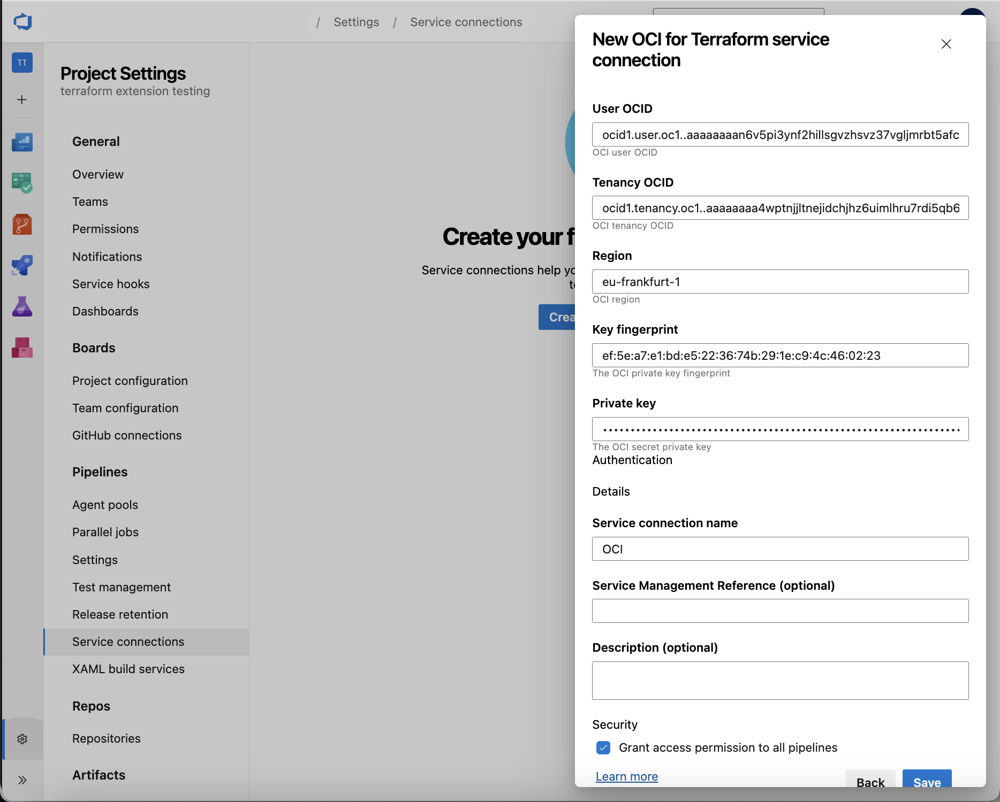

## About Terraform

Terraform is an open-source tool created by HashiCorp (an IBM Company) for developing, changing and versioning infrastructure safely and efficiently. It provides a service known as "Infrastructure as Code" which enables users to define and provision infrastructure using a high-level configuration language.

## About the Terraform extension

This extension provides the following components:

- A task for installing a specific version of Terraform, if not already installed, on the agent
- A task for executing the core Terraform commands
- A service connection for connecting to an Amazon Web Services(AWS) account
- A service connection for connecting to a Google Cloud Platform(GCP) account
- A service connection for connecting to a Oracle Cloud Infrastructure(OCI) account

The Terraform tool installer task acquires a specified version of [Terraform](https://www.terraform.io/) from the Internet or the tools cache and prepends it to the PATH of the Azure Pipelines Agent (hosted or private). This task can be used to change the version of Terraform used in subsequent tasks. Adding this task before the Terraform task in a build definition ensures you are using that task with the right Terraform version.

The Terraform task enables running Terraform commands as part of Azure Build and Release Pipelines providing support for the following Terraform commands

- init
- validate
- show
- plan
- apply
- output
- custom (any command terraform CLI supports natively)
- destroy

This extension is intended to run on **Windows**, **Linux** and **MacOS** agents.

## Terraform tool installer task

The TerraformInstaller task installs a specific version of Terraform on the agent. The task can be used to install a specific version of Terraform or the latest version.

### Example: Install the latest version of Terraform

```yaml
- task: TerraformInstaller@1
  displayName: 'Install Terraform'
  inputs:
    terraformVersion: 'latest'
```

### Example: Install a specific version of Terraform

```yaml
- task: TerraformInstaller@1
  displayName: 'Install Terraform'
  inputs:
    terraformVersion: '1.11.3'
```

## Terraform task

The Terraform task abstracts running Terraform commands as part of an Azure DevOps Pipeline.

This page documents version 5 of the task, referenced in YAML as `TerraformTask@5`. For version 4, see the [TerraformTaskV4 documentation](https://github.com/microsoft/azure-pipelines-terraform/tree/main/Tasks/TerraformTask/TerraformTaskV4).

### Steps to use the Terraform task

- Install this task from the [Marketplace](https://aka.ms/devlabs/tf/task).
- Create a service connetion if you don't already have one. See the [Creating a new service connection](#creating-a-new-service-connection) section below for more details.
- Create or open a YAML pipeline.
- Add the Terraform task to your pipeline YAML file.

### Examples: Run Terraform init, plan and apply for Microsoft Azure

#### Example: Using default settings with the same service connection for all tasks.

```yaml
- task: TerraformTask@5
  displayName: Run Terraform Init
  inputs:
    provider: 'azurerm'
    command: 'init'
    backendServiceArm: 'your-service-connection'
    backendAzureRmStorageAccountName: 'your-stg-name'
    backendAzureRmContainerName: 'your-container-name'
    backendAzureRmKey: 'state.tfstate'

- task: TerraformTask@5
  name: terraformPlan
  displayName: Run Terraform Plan
  inputs:
    provider: 'azurerm'
    command: 'plan'
    commandOptions: '-out tfplan'
    environmentServiceNameAzureRM: 'your-service-connection'

# Only runs if the 'terraformPlan' task has detected changes the in state.
- task: TerraformTask@5
  displayName: Run Terraform Apply
  condition: and(succeeded(), eq(variables['terraformPlan.changesPresent'], 'true'))
  inputs:
    provider: 'azurerm'
    command: 'apply'
    commandOptions: 'tfplan'
    environmentServiceNameAzureRM: 'your-service-connection'
```

#### Example: Run Terraform init, plan and apply for Microsoft Azure with different service connections for state and providers

Terraform on Azure currently only supports different identities / service connections for the backend state and providers for Workload identity federation when using ID Token Refresh. If you are not using ID Token refresh (the default) and have explicitly set the `backendAzureRmUseIdTokenGeneration` and / or `environmentAzureRmUseIdTokenGeneration` inputs to `false`, then you cannot use different service connections for the backend state and providers as it will result in an ID Token timeout.

In order to use different service connections for the backend state and providers, you need to set `backendAzureRmUseCliFlagsForAuthentication` to `true` in the Terraform task. This will set the backend configuration as CLI flags for the `client_id`, `ado_pipeline_service_connection_id` and `use_oidc` settings. This means that they will not read the environment variables set for the provider. You must take caustion when doing this, as it will cache these settings in the plan file and can have unexpected results depending on your combination of service connections.

The following example shows an example of using a 3 service connection setup with the Terraform task:

```yaml
trigger:
- main

stages:
# In Stage 1, run Terraform init and plan
# `your-backend-service-connection` identity only has Storage Blob Data Contributor permissions to the Storage Account Container
# `your-plan-service-connection` identity has Reader permissions to the Azure subscription
- stage: plan
  displayName: 'Terraform Plan'
  jobs:
  - job: plan
    displayName: 'Terraform Init and Plan'
    pool:
      vmImage: 'ubuntu-latest'
    steps:
    - task: TerraformInstaller@1
      displayName: 'Install Terraform'
      inputs:
        terraformVersion: 'latest'

    - task: TerraformTask@5
      displayName: Run Terraform Init
      inputs:
        provider: 'azurerm'
        command: 'init'
        backendServiceArm: 'your-backend-service-connection'
        backendAzureRmStorageAccountName: 'your-storage-account-name'
        backendAzureRmContainerName: 'your-container-name'
        backendAzureRmKey: 'state.tfstate'
        backendAzureRmUseCliFlagsForAuthentication: true

    - task: TerraformTask@5
      name: terraformPlan
      displayName: Run Terraform Plan
      inputs:
        provider: 'azurerm'
        command: 'plan'
        commandOptions: '-out tfplan'
        environmentServiceNameAzureRM: 'your-plan-service-connection'

    - task: CopyFiles@2
      displayName: Create Module Artifact
      inputs:
        SourceFolder: '$(Build.SourcesDirectory)'
        Contents: |
          **/*
          !.terraform/**/*
          !.git/**/*
          !**/.terraform/**/*
          !**/.git/**/*
        TargetFolder: '$(Build.ArtifactsStagingDirectory)'
        CleanTargetFolder: true
        OverWrite: true

    - task: PublishPipelineArtifact@1
      displayName: Publish Module Artifact
      inputs:
        targetPath: '$(Build.ArtifactsStagingDirectory)'
        artifact: 'terraformModule'
        publishLocation: 'pipeline'

# In Stage 2, run Terraform init and apply
# `your-backend-service-connection` identity only has Storage Blob Data Contributor permissions to the Storage Account Container
# `your-apply-service-connection` identity has Owner / Contributor permissions to the Azure subscription
- stage: apply
  displayName: 'Terraform Apply'
  jobs:
  - job: apply
    displayName: 'Terraform Init and Apply'
    pool:
      vmImage: 'ubuntu-latest'
    steps:
    - task: DownloadPipelineArtifact@2
      displayName: Download Module Artifact
      inputs:
        source: 'current'
        artifactName: 'terraformModule'
        targetPath: '$(Build.SourcesDirectory)'

    - task: TerraformInstaller@1
      displayName: 'Install Terraform'
      inputs:
        terraformVersion: 'latest'

    - task: TerraformTask@5
      displayName: Run Terraform Init
      inputs:
        provider: 'azurerm'
        command: 'init'
        backendServiceArm: 'your-backend-service-connection'
        backendAzureRmStorageAccountName: 'your-storage-account-name'
        backendAzureRmContainerName: 'your-container-name'
        backendAzureRmKey: 'state.tfstate'
        backendAzureRmUseCliFlagsForAuthentication: true

    - task: TerraformTask@5
      displayName: Run Terraform Apply
      inputs:
        provider: 'azurerm'
        command: 'apply'
        commandOptions: 'tfplan'
        environmentServiceNameAzureRM: 'your-apply-service-connection'
```

>NOTE: This example is not comprehensive, you need to consider using environments, concurrency control, deployment jobs, approvals on the service connection, private networking, and other best practices based your specific use case. This example is only designed to show the fundamentals of how to use the Terraform task with different service connections for the backend state and providers.

### Example: Run Terraform init, plan and apply for AWS

```yaml
- task: TerraformTask@5
  displayName: Run Terraform Init
  inputs:
    provider: 'aws'
    command: 'init'
    backendServiceAWS: 'your-service-connection'
    backendAWSBucketName: 'your-bucket-name'
    backendAWSKey: 'state.tfstate'

- task: TerraformTask@5
  name: terraformPlan
  displayName: Run Terraform Plan
  inputs:
    provider: 'aws'
    command: 'plan'
    commandOptions: '-out tfplan'
    environmentServiceNameAWS: 'your-service-connection'

# Only runs if the 'terraformPlan' task has detected changes the in state.
- task: TerraformTask@5
  displayName: Run Terraform Apply
  condition: and(succeeded(), eq(variables['terraformPlan.changesPresent'], 'true'))
  inputs:
    provider: 'aws'
    command: 'apply'
    commandOptions: 'tfplan'
    environmentServiceNameAWS: 'your-service-connection'
```

### Example: Run Terraform init, plan and apply for GCP

```yaml
- task: TerraformTask@5
  displayName: Run Terraform Init
  inputs:
    provider: 'gcp'
    command: 'init'
    backendServiceGCP: 'your-service-connection'
    backendGCPBucketName: 'your-bucket-name'
    backendGCPPrefix: 'state.tfstate'

- task: TerraformTask@5
  name: terraformPlan
  displayName: Run Terraform Plan
  inputs:
    provider: 'gcp'
    command: 'plan'
    commandOptions: '-out tfplan'
    environmentServiceNameGCP: 'your-service-connection'

# Only runs if the 'terraformPlan' task has detected changes the in state.
- task: TerraformTask@5
  displayName: Run Terraform Apply
  condition: and(succeeded(), eq(variables['terraformPlan.changesPresent'], 'true'))
  inputs:
    provider: 'gcp'
    command: 'apply'
    commandOptions: 'tfplan'
    environmentServiceNameGCP: 'your-service-connection'
```

### Example: Run Terraform init, plan and apply for OCI

```yaml
- task: TerraformTask@5
  displayName: Run Terraform Init
  inputs:
    provider: 'oci'
    command: 'init'
    backendServiceOCI: 'your-service-connection'
    backendOCIPar: 'state.tfstate'

- task: TerraformTask@5
  name: terraformPlan
  displayName: Run Terraform Plan
  inputs:
    provider: 'oci'
    command: 'plan'
    commandOptions: '-out tfplan'
    environmentServiceNameOCI: 'your-service-connection'

# Only runs if the 'terraformPlan' task has detected changes the in state.
- task: TerraformTask@5
  displayName: Run Terraform Apply
  condition: and(succeeded(), eq(variables['terraformPlan.changesPresent'], 'true'))
  inputs:
    provider: 'oci'
    command: 'apply'
    commandOptions: 'tfplan'
    environmentServiceNameOCI: 'your-service-connection'
```

### Input parameters

The Terraform task has the following input parameters:

#### Shared Inputs

- `provider`: The cloud provider to use. The options are `azurerm`, `aws`, `gcp`, and `oci`. The default value is `azurerm`.
- `command`: The Terraform command to run. The options are `init`, `validate`, `show`, `plan`, `apply`, `output`, `destroy`, and `custom`. The default value is `init`.
- `workingDirectory`: The working directory to run the command in. The default value is `$(System.DefaultWorkingDirectory)`.

#### Backend Specific Inputs for the `init` command

##### Azure Specific Inputs for `init`

- `backendServiceArm`: The name of the Azure service connection to use for the `azurerm` backend. The default value is `''`.
- `backendAzureRmUseEntraIdForAuthentication`: Use Azure Entra ID for authentication for the storage account. The default value is `true`.
- `backendAzureRmStorageAccountName`: The name of the Azure storage account to use for the `azurerm` backend. The default value is `''`.
- `backendAzureRmContainerName`: The name of the Azure storage container to use for the `azurerm` backend. The default value is `''`.
- `backendAzureRmKey`: The name of the Azure storage blob to use for the `azurerm` backend. The default value is `''`.
- `backendAzureRmOverrideSubscriptionID`: The override subscription ID to use for the `azurerm` backend. This is only required if using URI lookup and if you don't want to use the service connection subscription ID. The default value is `''`.
- `backendAzureRmResourceGroupName`: The name of the Azure resource group the Storage Account sits in to use for the `azurerm` backend. This is only required if using URI lookup. The default value is `''`.
- `backendAzureRmUseIdTokenGeneration`: Whether to use ID token generation for the `azurerm` backend Workload identity federation. This is a fallback setting for older backend versions and can result in unexpected timeout issues. The default value is `false`.
- `backendAzureRmUseCliFlagsForAuthentication`: Whether to use CLI flags for authentication for the `azurerm` backend. This is required if you want to use different service connections for the backend state and providers. It will set `client_id`, `ado_pipeline_service_connection_id` and `use_oidc` as CLI flags, so they are persisted in the plan file. The default value is `false`.

##### AWS Specific Inputs for `init`

- `backendServiceAWS`: The name of the AWS service connection to use for the `aws` backend. The default value is `''`.
- `backendAWSBucketName`: The name of the AWS S3 bucket to use for the `aws` backend. The default value is `''`.
- `backendAWSBucketKey`: The name of the AWS S3 object to use for the `aws` backend. The default value is `''`.

##### GCP Specific Inputs for `init`

- `backendServiceGCP`: The name of the GCP service connection to use for the `gcp` backend. The default value is `''`.
- `backendGCPBucketName`: The name of the GCP bucket to use for the `gcp` backend. The default value is `''`.
- `backendGCPPrefix`: The name of the GCP object to use for the `gcp` backend. The default value is `''`.

##### OCI Specific Inputs for `init`

- `backendServiceOCI`: The name of the OCI service connection to use for the `oci` backend. The default value is `''`.
- `backendOCIPar`: The OCI object storage PAR configuration for the Terraform remote state file to use for the `oci` backend. The default value is `''`.
- `backendOCIConfigGenerate`: Whether to generate the Terraform remote state file config (Use Yes when not included in TF files) for the `oci` backend. The default value is `yes`.

#### Command and Cloud Specific Inputs for the `plan`, `apply`, and `destroy` commands

- `commandOptions`: The additional command arguments to pass to the command. The default value is `''`.
- `customCommand`: The custom command to run if `command` is set to `custom`. The default value is `''`.
- `outputTo`: Choose whether to output to the console or a file for the `show` and `output` Terraform commands. The options are `console`, and `file`. The default value is `console`.
- `fileName`: The name of the file to output to for the `show` and `output` commands if `outputTo` is set to `file`. For JSON plan output, this will also be used as the name for the terraform plan to display in the Terraform Plan tab. If not provided, a default name will be used. The default value is `''`.
- `outputFormat`: The output format to use for the `show` command. The options are `json`, and `default`. The default value is `default`.
- `publishPlan`: When using the `plan` command, if provided, the terraform plan will be published for visualization in the Terraform Plan tab using this name. Leave empty to disable plan publishing. The default value is `''`.

##### Azure Specific Inputs for `plan`, `apply`, and `destroy`

- `environmentServiceNameAzureRM`: The name of the Azure service connection to use for the Azure providers. The default value is `''`.
- `environmentAzureRmOverrideSubscriptionID`: The override subscription ID to use for the Azure providers. This is only required if you don't want to use the service connection subscription ID. The default value is `''`.
- `environmentAzureRmUseIdTokenGeneration`: Whether to use ID token generation for the Azure providers with Workload identity federation. This is a fallback setting for older provider versions and can result in unexpected timeout issues. The default value is `false`.

##### AWS Specific Inputs for `plan`, `apply`, and `destroy`

- `environmentServiceNameAWS`: The name of the AWS service connection to use for the `aws` provider. The default value is `''`.

##### GCP Specific Inputs for `plan`, `apply`, and `destroy`

- `environmentServiceNameGCP`: The name of the GCP service connection to use for the `gcp` provider. The default value is `''`.

##### OCI Specific Inputs for `plan`, `apply`, and `destroy`

- `environmentServiceNameOCI`: The name of the OCI service connection to use for the `oci` provider. The default value is `''`.

### Terraform Plan tab

The extension adds a **Terraform Plan** tab to the build results page, so a plan can be reviewed in the browser instead of by reading the build log. The tab appears on any run that used the Terraform task, and shows the plans that run published.

#### Publishing a plan

There are three ways to publish a plan. In each case the name shown in the tab is taken from the input listed below:

| How to publish | Name shown in the tab |
| --- | --- |
| `command: plan` with a name in `publishPlan` | the `publishPlan` value |
| `command: show` with `outputFormat: json` and `outputTo: console` | `fileName`, or `terraform-plan` if it is empty |
| `command: show` with `outputFormat: json` and `outputTo: file` | `fileName`, or the output file name if it is empty |

Publishing directly from the `plan` command is the shortest route:

```yaml
- task: TerraformTask@5
  name: terraformPlan
  displayName: Run Terraform Plan
  inputs:
    provider: 'azurerm'
    command: 'plan'
    commandOptions: '-out tfplan'
    environmentServiceNameAzureRM: 'your-service-connection'
    publishPlan: 'Production plan'
```

When `publishPlan` is set, the task needs a saved plan file to convert to JSON:

- If `commandOptions` already contains `-out`, that file is used and left in place.
- If it does not, the task appends its own `-out` pointing at a generated file under `$(System.DefaultWorkingDirectory)`, and deletes that file once the plan has been published.

The published JSON is also written to `$(System.DefaultWorkingDirectory)` as `<name>.json`, with any character outside `A-Z a-z 0-9 . _ -` replaced by an underscore. The name shown in the tab keeps the value exactly as you entered it, so two plans whose names differ only in those characters share one file on disk — give them names that differ in more than punctuation.

If publishing fails, the task raises a warning and the pipeline continues; the plan itself is unaffected.

#### Reading the tab

A run that publishes more than one plan gets a dropdown at the top of the tab, labelled with the names above, and it opens on the last plan published. A pipeline that plans several workspaces or environments therefore wants a distinct name per plan.

For a JSON plan the tab shows the Terraform and format versions, a **Resource Changes** summary counting the resources per action, and a **Resource Change Details** list with one expandable entry per resource showing its address, its actions and its before and after values. Entries holding sensitive values carry a **Contains sensitive data** badge. A collapsed **View Complete Plan** section holds the whole plan document.

Output that is not a JSON plan is shown as text, with terminal colours preserved. Only JSON plans get the summary and per-resource sections, so use `outputFormat: json` if you want the structured view.

#### Sensitive values

Values that Terraform marks as sensitive are replaced with `***REDACTED***` before the plan is displayed. This covers resource attributes Terraform flags in the plan document and outputs declared with `sensitive = true`. The tab additionally hides values whose name suggests a credential — among them `password`, `secret`, `token`, `api_key`, `primary_key` and `connection_string` — and replaces recognisable SSH and PEM private keys and Azure subscription IDs wherever they appear.

Redaction is a best-effort safety net rather than a guarantee, and two limits matter before publishing plans from a pipeline that handles production credentials:

- Terraform does not mark root input variables as sensitive in the plan document, so they are matched by name only. Declaring a variable `sensitive = true` is what makes it redacted where it flows into resource attributes.
- A credential returned by a provider in a plainly named attribute is shown in full. Names chosen to stay readable, such as `key_vault_secret_id`, `secret_name` and `token_endpoint`, are never redacted, since they normally identify a secret rather than contain one.

A published plan is stored as a build attachment, so anyone who can read the build can read the plan. Treat the tab as having the same audience as the build log.

#### The tab says no plans were published

The tab reports `No terraform plans have been published for this pipeline run.` when the run produced no plan attachment. Check that the publishing task used one of the three combinations in the table above — most often `outputFormat` was left at `default`, or `publishPlan` was left empty. Publishing requires version 4 or 5 of the Terraform task; earlier versions never publish, and the tab is shown for them regardless.

### Creating a new service connection

The Terraform task requires a service connection for setting up the credentials to connect to the provider account. For setting up a new service connection:

#### Create a new service connection for connecting to an Azure account

Follow the instructions in the [Azure DevOps documentation](https://learn.microsoft.com/en-us/azure/devops/pipelines/library/connect-to-azure?view=azure-devops) to create a new service connection for connecting to an Azure account using Workload identity federation.

#### Create a new service connection for connecting to an AWS account

The Terraform task requires a AWS service connection for setting up the credentials to connect to an AWS account. For setting up a new AWS service connection:

- On the project page, go to **Project settings** and choose **Service connections**.
- In the **New service connection** list, choose **AWS for Terraform**.
- Enter the following details to set up the service connection:
  - **Connection name\*:** Enter a unique name of the service connection to identify it within the project
  - **Access key id\*:** Enter the access key id for your AWS account
  - **Secret access key\*:** Enter the secret access key associated with the access key id
  - **Region\*:** Enter the region of the Amazon Simple Storage Service(S3) bucket in which you want to store the Terraform remote state file e.g. 'us-east-1'



#### Create a new service connection for connecting to a GCP account

The Terraform task requires a GCP service connection for setting up the credentials to connect to a GCP service account. For setting up a new GCP service connection:

- Download the JSON key file containing the required credentials
  - In the GCP Console, go to the **[Create service account key](https://console.cloud.google.com/apis/credentials/serviceaccountkey?_ga=2.139902131.-101031797.1559296298)** page.
  - From the **Service account** list, select the existing service account or **New service account** to create a new one.
  - If **New service account** was selected in the previous step, in the **Service account name** field, enter a name.
  - From the **Role** list, select **Project** > **Owner**.
  - Click **Create**. A JSON file that contains your key downloads to your computer.
- On the project page, go to **Project settings** and choose **Service connections**.
- In the **New service connection** list, choose **GCP for Terraform**.
- Enter the following details to set up the service connection:
  - **Connection name\*:** Enter a unique name of the service connection to identify it within the project
  - **Project id\*:** Enter the project id of the GCP project in which the resources will be managed
  - **Client email\*:** Enter the value of the **client_email** field in the JSON key file
  - **Token uri\*:** Enter the value of the **token_uri** field in the JSON key file
  - **Scope\*:** Enter the scope of access to GCP resources e.g. https://www.googleapis.com/auth/cloud-platform. For more information, see [granting roles to service accounts](https://cloud.google.com/iam/docs/granting-roles-to-service-accounts)
  - **Private key\*:** Enter the value of the **private_key** field in the JSON key file



#### Create a new service connection for connecting to a OCI account

The Terraform task requires a OCI service connection for setting up the credentials to connect to an OCI account. For setting up a new OCI service connection:

- Using OCI Console add an API Key by generating it (https://docs.oracle.com/en-us/iaas/Content/API/Concepts/apisigningkey.htm#two) and download it
- On the project page, go to **Project settings** and choose **Service connections**.
- In the **New service connection** list, choose **OCI for Terraform**.
- Enter the following details to set up the service connection:
  - **Connection name\*:** Enter a unique name of the service connection to identify it within the project
  - **User OCID\*:** Enter the OCI account **user OCID** copying it from your OCI Console User Profile information
  - **Tenancy OCID\*:** Enter the OCI **tenancy OCID** copying it from your OCI Console Tenancy information
  - **Region\*:** Enter the value of the **region** you want to manage with Terraform e.g. eu-frankfurt-1
  - **Key fingerprint\*:** Enter the value of the API Key **fingerprint** copying it from OCI Console generated in the first step
  - **Private key\*:** Enter the value of the contents of the **private_key** file generated and downloaded in the first step



## Troubleshooting

### How to resolve an error about AzureCLI Authorizer

In you are using older Azure provider or backend versions, you may encounter the following or similar error when running the Terraform task:

`Error: unable to build authorizer for Resource Manager API: could not configure AzureCli Authorizer: obtaining subscription ID: obtaining account details: running Azure CLI: exit status 1: ERROR: Please run 'az login' to setup account.`

If you see an error like this, then it means you are using a provider or backend version that does not support Workload identity federation ID Token Refresh. To resolve this, you can either:

1. Update your Terraform CLI and / or Azure proividers to the latest version (recommended)
2. Fallback to ID token generation by setting the `backendAzureRmUseIdTokenGeneration` and / or `environmentAzureRmUseIdTokenGeneration` inputs to `true` in the Terraform task. This is a fallback setting for older provider versions and can result in unexpected timeout issues, so please consider using current versions of the Terraform CLI and Azure providers before resorting to this option.

Support for ID Token Refresh was introduced in:

- Terraform CLI 1.11.1
- AzureRM Provider 4.18.0
- AzureAD Provider 3.2.0
- AzAPI Provider 2.0.1
